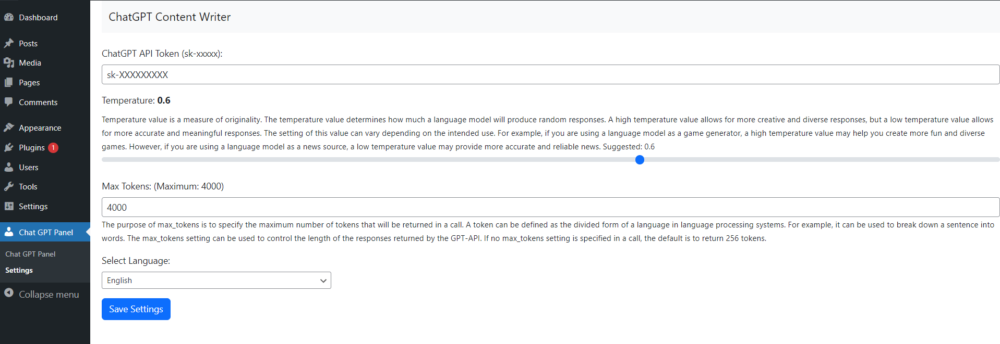
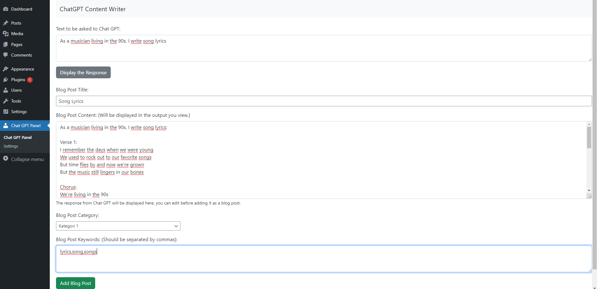
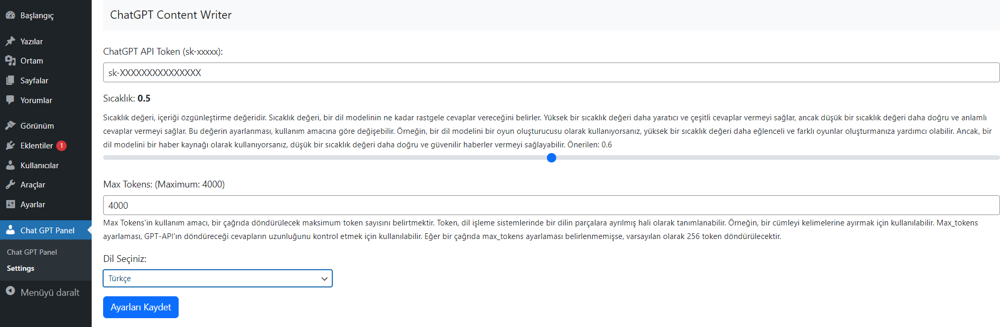
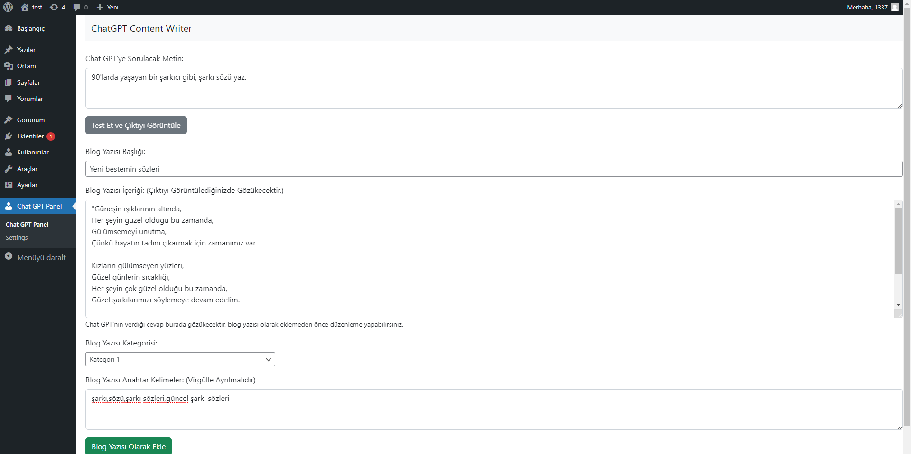

# Chat GPT Content Writer | Wordpress Plugin

# EN
This WordPress plugin allows you to add the text you write as a WordPress blog post by using the Chat GPT API.
<h2>Installation:</h2> 
<b>1-)</b> Download the Chat GPT Content Writer plugin. 
<b>2-)</b> Install the plugin on WordPress. 
<b>3-)</b> Enter your API KEY in the Settings section and make other fine adjustments (TO CREATE API KEY: https://beta.openai.com/account/api-keys) 
<b>4-)</b> Ready for use, you can now manage the plugin from the panel section. 

# Images
 

The plugin is continuously being developed, you can use the following links for communication and support.

# TR
<h2>Kurulum:</h2> 
<b>1-)</b> Chat GPT Content Writer eklentisini indirin. 
<b>2-)</b> Wordpress'e eklentiyi yükleyin. 
<b>3-)</b> Settings bölümünden, API KEY'inizi girin ve diğer ince ayarları yapın. (API KEY OLUŞTURMAK İÇİN: https://beta.openai.com/account/api-keys) 
<b>4-)</b> Kullanıma hazır, Artık panel bölümünden eklentiyi yönetebilirsiniz. 

# Ekran Görüntüleri
 
 

Eklenti üzerinde geliştirmeler devam ediyor, iletişim ve destek için aşağıdaki bağlantıları kullanabilirsiniz.

<h2>Buy me a coffee: </h2> 
https://www.buymeacoffee.com/huseyintintas

<h2>Contact: </h2> 
mail@huseyintintas.com 
https://twitter.com/1337stif
